# SC-PH0-T06 — Documenter l'architecture actuelle avec diagrammes

> **User Story** : SC-US-PH0-06 — En tant que développeur, je veux mettre à jour les dépendances vulnérables
> **Tâche** : Documenter architecture actuelle avec diagrammes
> **Projet** : simpl1Control v1.1.2
> **Date** : 13 février 2026
> **Méthode** : Analyse statique du code source (read-only, aucune modification)

---

## Table des matières

1. [Vue d'ensemble du système](#1-vue-densemble-du-système)
2. [Diagramme d'architecture globale (déploiement)](#2-diagramme-darchitecture-globale-déploiement)
3. [Diagramme de la stack technologique](#3-diagramme-de-la-stack-technologique)
4. [Architecture backend — structure des modules](#4-architecture-backend--structure-des-modules)
5. [Architecture frontend — structure des modules](#5-architecture-frontend--structure-des-modules)
6. [Diagramme entité-relation (base de données)](#6-diagramme-entité-relation-base-de-données)
7. [Diagramme des routes API REST](#7-diagramme-des-routes-api-rest)
8. [Diagramme des routes frontend](#8-diagramme-des-routes-frontend)
9. [Diagramme de flux MQTT et temps réel](#9-diagramme-de-flux-mqtt-et-temps-réel)
10. [Diagramme de séquence — contrôle d'accès NFC](#10-diagramme-de-séquence--contrôle-daccès-nfc)
11. [Diagramme de séquence — authentification](#11-diagramme-de-séquence--authentification)
12. [Diagramme de dépendances des services backend](#12-diagramme-de-dépendances-des-services-backend)
13. [Inventaire des dépendances externes](#13-inventaire-des-dépendances-externes)
14. [Constats sur l'architecture](#14-constats-sur-larchitecture)
15. [Synthèse](#15-synthèse)

---

## 1. Vue d'ensemble du système

### 1.1 Description

simpl1Control est un **dashboard IoT monorepo** pour le contrôle de bâtiment. Il combine :

- Un **backend Fastify** (API REST + WebSocket + MQTT) pour la gestion des devices, l'authentification et le temps réel
- Un **frontend React 19** (SPA) pour la visualisation des données et l'administration
- Une communication **MQTT bidirectionnelle** avec des automates Siemens LOGO 8.4, des capteurs de température et des lecteurs NFC
- Un système de **contrôle d'accès physique** par badges MIFARE via NFC

### 1.2 Chiffres clés

| Métrique | Valeur |
|---|---|
| Version | 1.1.2 |
| Gestionnaire de paquets | pnpm (monorepo) |
| Packages | 2 (backend + frontend) |
| Fichiers source backend | ~100 fichiers |
| Fichiers source frontend | ~120 fichiers |
| Entités base de données | 7 |
| Endpoints API REST | 17 |
| Routes frontend | 14 |
| Dépendances backend (prod) | 33 |
| Dépendances frontend (prod) | 26 |

---

## 2. Diagramme d'architecture globale (déploiement)

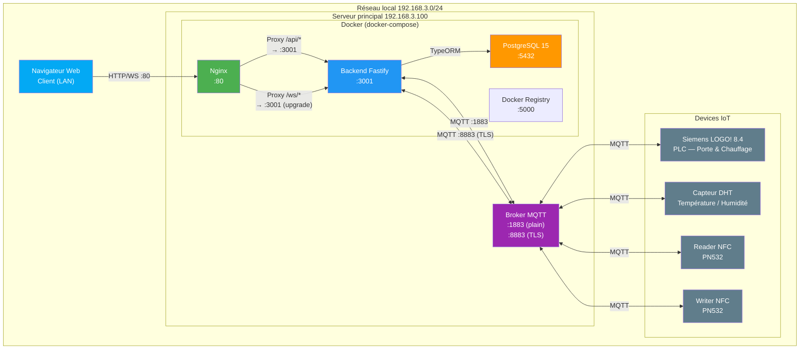

### 2.1 Notes de déploiement

- Le frontend est servi comme SPA statique par Nginx
- Nginx agit en reverse proxy vers le backend pour `/api/*` et `/ws/*`
- Le backend se connecte au broker MQTT sur deux ports (plain 1883, TLS 8883) au démarrage (`MQTT_START=true`)
- Le service discovery Docker utilise le nommage `myapp-backend-1` dans la config Nginx
- Le serveur `192.168.3.100` concentre tous les services (Docker, broker MQTT, registre Docker)

---

## 3. Diagramme de la stack technologique

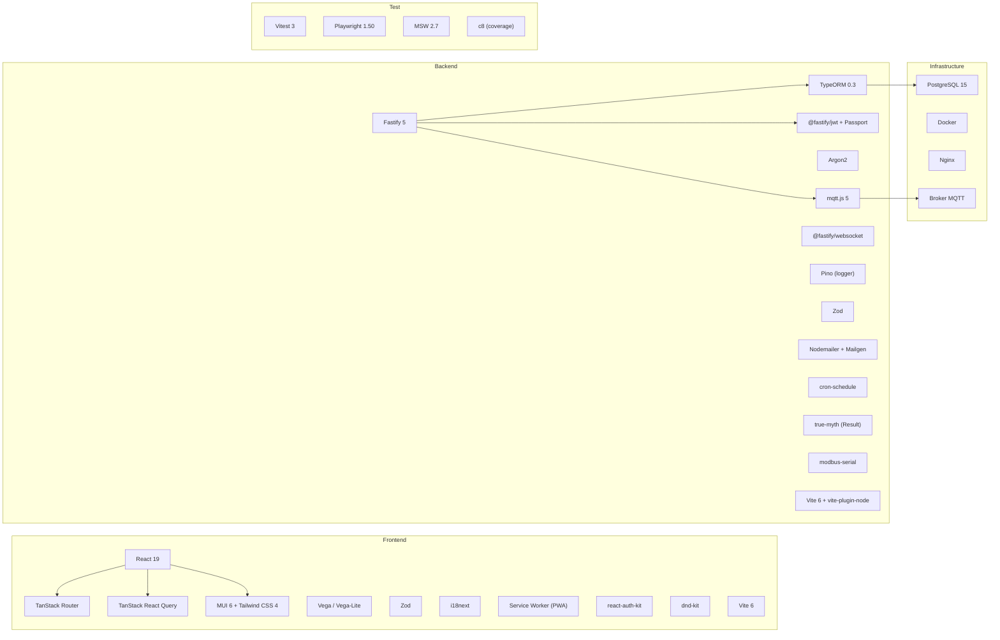

---

## 4. Architecture backend — structure des modules

```mermaid
graph TB
    subgraph "Entry Point"
        SERVER["server.ts<br/>Initialisation Fastify + MQTT + CRON"]
    end

    subgraph "Plugins"
        ERROR["error-handler.ts"]
        WS_PLUGIN["websocket.plugin.ts"]
    end

    subgraph "Features (feature-based architecture)"
        subgraph "auth/"
            AUTH_SVC["auth.service.ts"]
            LOGIN["login.route.ts"]
            REFRESH["refresh-token.route.ts"]
            FORGOT["forgot-password.route.ts"]
            RESET["reset-password.route.ts"]
            PROFILE["profile.route.ts"]
        end

        subgraph "users/"
            USER_ENTITY["user.entity.ts"]
            USER_REPO["user.repository.ts"]
            ADD_USER["addUser.route.ts"]
            GET_USERS["getAllUsers.route.ts"]
            GET_USER["getUser.route.ts"]
            DEL_USER["deleteUser.route.ts"]
            UPD_USER["updateUser.route.ts"]
        end

        subgraph "devices/"
            DEV_ENTITY["device.entity.ts"]
            DEV_REPO["device.repository.ts"]
            ADD_DEV["addDevice.route.ts"]
            GET_DEVS["getAllDevices.route.ts"]
            GET_DEV["getDevice.route.ts"]
            UPD_DEV["updateDevice.route.ts"]
            ACT_DEV["ActiveDevice.route.ts"]
        end

        subgraph "badges/"
            BADGE_ENTITY["badges.entity.ts"]
            BADGE_SVC["badge.service.ts"]
            BADGE_REPO["badges.repository.ts"]
            ADD_BADGE["badges.add.route.ts"]
            UPD_BADGE["badges.update.route.ts"]
            DEL_BADGE["badges.delete.route.ts"]
            VALIDATE["validateBadge.ts"]
            DERIVE_KEY["deriveBadgeKey.utils.ts"]
            DERIVE_AB["deriveKeysAB.utils.ts"]
        end

        subgraph "charts/"
            PAGE_ENTITY["page.entity.ts"]
            CARD_ENTITY["cards.entity.ts"]
            PAGE_REPO["page.repository.ts"]
            GET_PAGES["getAllPages.route.ts"]
            GET_PAGE["getOnePage.route.ts"]
            CHARTS_WS["charts.ws.ts"]
        end

        subgraph "data-histories/"
            DH_ENTITY["data-history.entity.ts"]
            DH_REPO["data-histories.repository.ts"]
            DH_ROUTE["data-histories.route.ts"]
        end

        subgraph "access-log/"
            AL_ENTITY["access-log.entity.ts"]
            AL_REPO["access-logs.repository.ts"]
            AL_ROUTE["getAllAccessLogs.route.ts"]
        end
    end

    subgraph "Services transverses"
        MQTT_SVC["mqtt.service.ts<br/>(singleton par URL)"]
        HASH_SVC["hash.service.ts<br/>(Argon2)"]
        EMAIL_SVC["email.service.ts<br/>(Nodemailer)"]
        CRON_SVC["cron.service.ts<br/>(Mutex)"]
        LOGO_PUB["logo-publisher.service.ts"]
        PING_PONG["ping-pong.service.ts"]
        RELOAD_MQTT["reload-mqtt.service.ts"]
        READER_ACCESS["handleReaderAccess.ts"]
    end

    subgraph "Realtime"
        KEY_MAPPER["key-mapper.ts<br/>DSL + Logo84 + Generic"]
        RT_HUB["realtime-hub.ts<br/>(pub/sub WebSocket)"]
    end

    subgraph "CRON Jobs"
        CRON_SETUP["cron-setup.ts"]
        LOGO_JOB["logo-publish-job.ts<br/>*/5s"]
        PING_JOB["ping-pong<br/>*/5s"]
    end

    SERVER --> ERROR
    SERVER --> WS_PLUGIN
    SERVER --> CRON_SETUP
    SERVER --> MQTT_SVC
    SERVER --> RELOAD_MQTT
    CRON_SETUP --> LOGO_JOB
    CRON_SETUP --> PING_JOB
    LOGO_JOB --> LOGO_PUB
    PING_JOB --> PING_PONG
    MQTT_SVC --> DH_REPO
    MQTT_SVC --> READER_ACCESS
    MQTT_SVC --> LOGO_PUB
    DH_REPO --> KEY_MAPPER
    DH_REPO --> RT_HUB
    CHARTS_WS --> RT_HUB
    READER_ACCESS --> MQTT_SVC
    READER_ACCESS --> VALIDATE
    AUTH_SVC --> HASH_SVC
    AUTH_SVC --> EMAIL_SVC
    BADGE_SVC --> DERIVE_KEY
    BADGE_SVC --> DERIVE_AB
    LOGO_PUB --> MQTT_SVC
    LOGO_PUB --> DEV_REPO
    PING_PONG --> MQTT_SVC
    PING_PONG --> DEV_REPO
    RELOAD_MQTT --> DEV_REPO
    RELOAD_MQTT --> MQTT_SVC
```

### 4.1 Pattern architectural backend

Le backend suit une **architecture feature-based** (par domaine métier) :

```
features/
├── auth/           → Authentification (login, refresh, forgot, reset, profile)
├── users/          → Gestion des utilisateurs CRUD
├── devices/        → Gestion des devices IoT CRUD
├── badges/         → Gestion des badges NFC MIFARE
├── charts/         → Pages et cartes de visualisation + WebSocket
├── data-histories/ → Historique des données MQTT
└── access-log/     → Journaux d'accès physique
```

Chaque feature contient : `entity.ts` (modèle TypeORM), `repository.ts` (accès données), `schema.ts` (validation Zod), et des sous-dossiers par route (`add/`, `getAll/`, etc.).

---

## 5. Architecture frontend — structure des modules

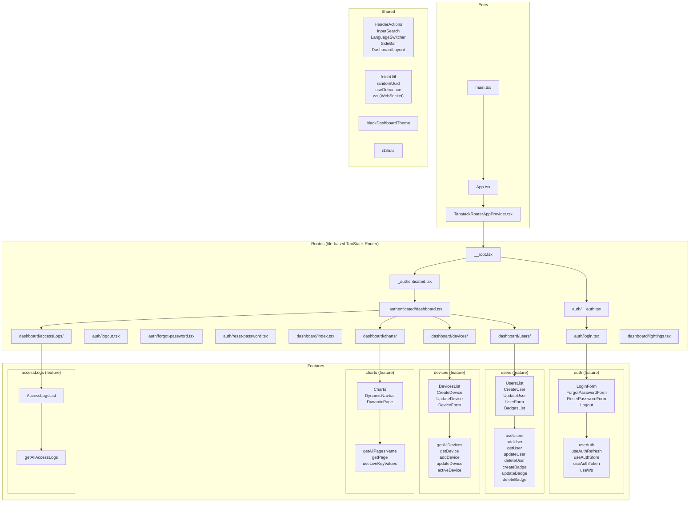

### 5.1 Pattern architectural frontend

Le frontend suit le même pattern **feature-based** avec TanStack Router en routing par fichier :

```
src/
├── routes/          → File-based routing (génère routeTree.gen.ts)
│   ├── auth/        → Routes publiques (login, forgot, reset)
│   └── _authenticated/dashboard/  → Routes protégées
├── features/        → Modules métier
│   ├── auth/        → components/ + hooks/ + types/ + mocks/
│   ├── users/       → components/ + hooks/ + types/ + schemas/
│   ├── devices/     → components/ + hooks/ + types/ + schemas/
│   ├── charts/      → components/ + hooks/ + schemas/
│   └── accessLogs/  → components/ + hooks/ + types/
├── components/      → Composants partagés (Sidebar, Layout)
├── utils/           → Utilitaires (fetch, WS, debounce)
└── themes/          → Thème MUI
```

---

## 6. Diagramme entité-relation (base de données)

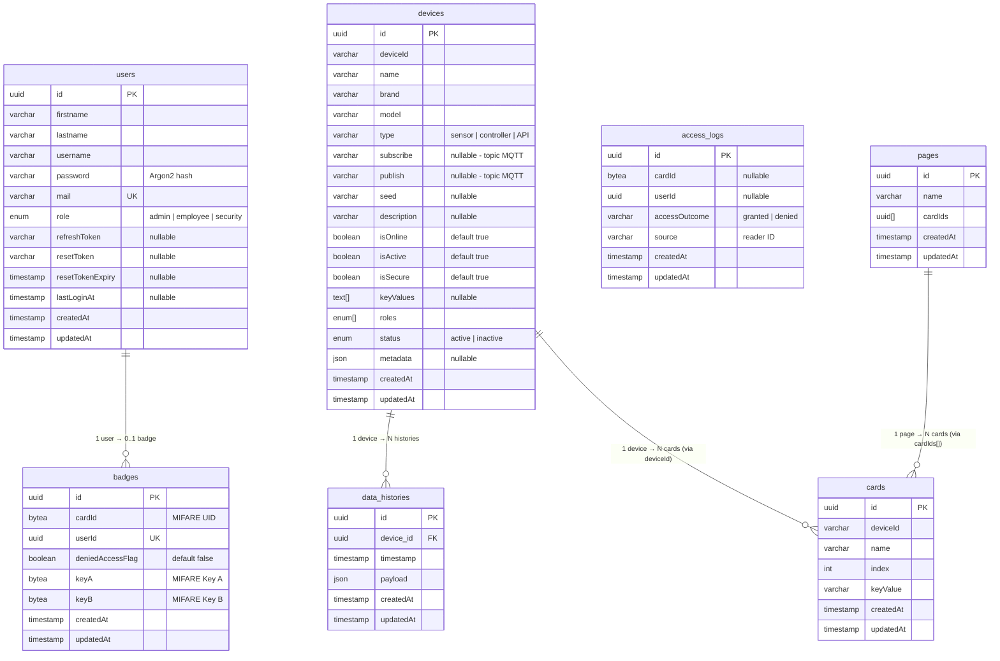

### 6.1 Notes sur le modèle

- **7 entités** au total, toutes avec UUID comme clé primaire (via `BaseEntity`)
- Les relations `pages ↔ cards` et `devices ↔ cards` passent par des champs `cardIds[]` et `deviceId` (varchar) plutôt que par des FK TypeORM — ce sont des **relations logiques non contraintes** en base
- La relation `badges ↔ users` est liée par `userId` (unique) mais sans FK TypeORM déclarée
- Les `access_logs` référencent `cardId` et `userId` sans FK — journalisation découplée
- `data_histories` est la seule entité avec une vraie relation TypeORM (`@ManyToOne`)

---

## 7. Diagramme des routes API REST

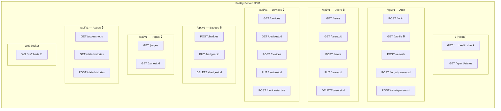

### 7.1 Détail des endpoints

| Méthode | Route | Auth | Description |
|---|---|---|---|
| `GET` | `/` | Non | Health check |
| `GET` | `/api/v1/status` | Non | Statut API |
| `POST` | `/api/v1/login` | Non | Connexion (username/email + password) |
| `POST` | `/api/v1/refresh` | JWT | Renouvellement access token |
| `POST` | `/api/v1/forgot-password` | Non | Demande de réinitialisation |
| `POST` | `/api/v1/reset-password` | Non | Réinitialisation avec token |
| `GET` | `/api/v1/profile` | JWT | Profil utilisateur connecté |
| `GET` | `/api/v1/users` | JWT | Liste paginée (page, size) |
| `GET` | `/api/v1/users/:id` | JWT | Détail utilisateur |
| `POST` | `/api/v1/users` | JWT | Création utilisateur |
| `PUT` | `/api/v1/users/:id` | JWT | Mise à jour utilisateur |
| `DELETE` | `/api/v1/users/:id` | JWT | Suppression utilisateur |
| `GET` | `/api/v1/devices` | JWT | Liste paginée (page, size, includeActived) |
| `GET` | `/api/v1/devices/:id` | JWT | Détail device |
| `POST` | `/api/v1/devices` | JWT | Création device |
| `PUT` | `/api/v1/devices/:id` | JWT | Mise à jour device |
| `POST` | `/api/v1/devices/active` | JWT | Toggle actif/inactif |
| `POST` | `/api/v1/badges` | JWT | Ajout badge NFC |
| `PUT` | `/api/v1/badges/:id` | JWT | Modification badge |
| `DELETE` | `/api/v1/badges/:id` | JWT | Suppression badge |
| `GET` | `/api/v1/pages` | JWT | Liste des pages dashboard |
| `GET` | `/api/v1/pages/:id` | JWT | Détail page avec cards |
| `GET` | `/api/v1/access-logs` | JWT | Liste des logs d'accès |
| `GET` | `/api/v1/data-histories` | JWT | Historique données |
| `POST` | `/api/v1/data-histories` | JWT | Sauvegarde données |
| `WS` | `/ws/charts` | Cookie JWT | Temps réel (subscribe/unsubscribe) |

---

## 8. Diagramme des routes frontend

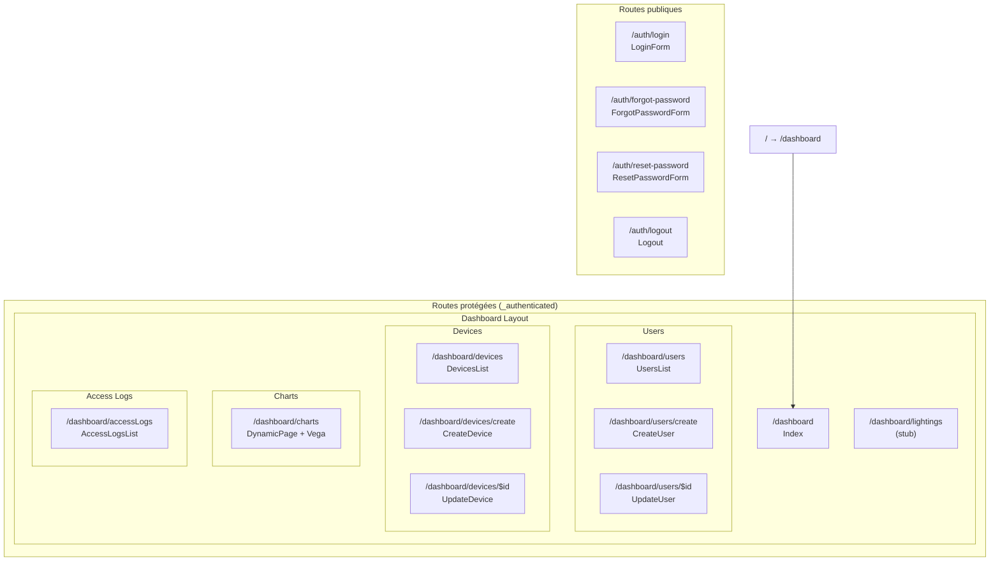

---

## 9. Diagramme de flux MQTT et temps réel

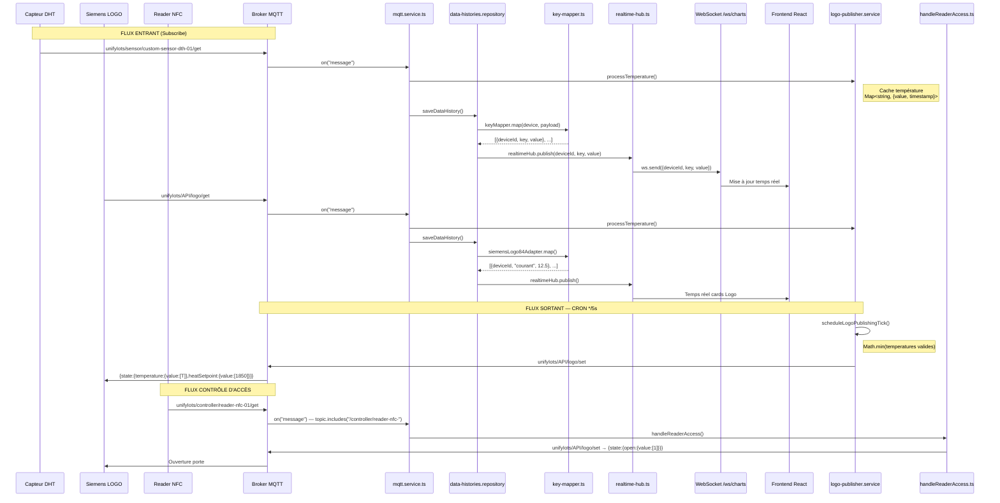

### 9.1 Topics MQTT par device

| Device | Type | Subscribe (get) | Publish (set) |
|---|---|---|---|
| custom-sensor-dth-01 | sensor | `unifyIots/sensor/custom-sensor-dth-01/get` | — |
| reader-nfc-01 | controller | `unifyIots/controller/reader-nfc-01/get` | `unifyIots/controller/reader-nfc-01/set` |
| writer-nfc-01 | controller | `unifyIots/controller/writer-nfc-01/get` | `unifyIots/controller/writer-nfc-01/set` |
| logo-01 | API | `unifyIots/API/logo/get` | `unifyIots/API/logo/set` |

### 9.2 Convention des topics

```
unifyIots/{type}/{deviceId}/{get|set}
```

- `get` : topic subscribe (device → backend)
- `set` : topic publish (backend → device)
- `{type}` : `sensor`, `controller`, ou `API`

---

## 10. Diagramme de séquence — contrôle d'accès NFC

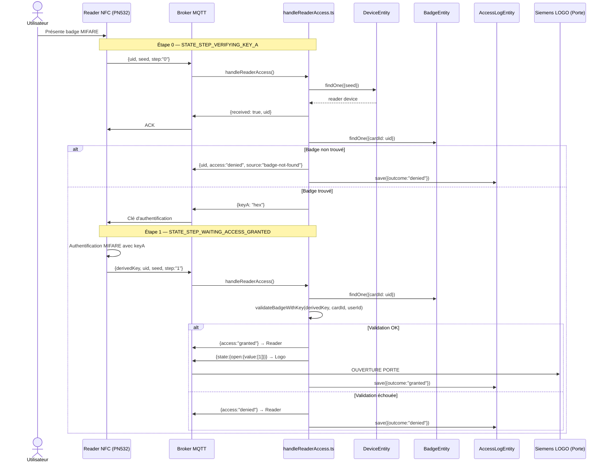

---

## 11. Diagramme de séquence — authentification

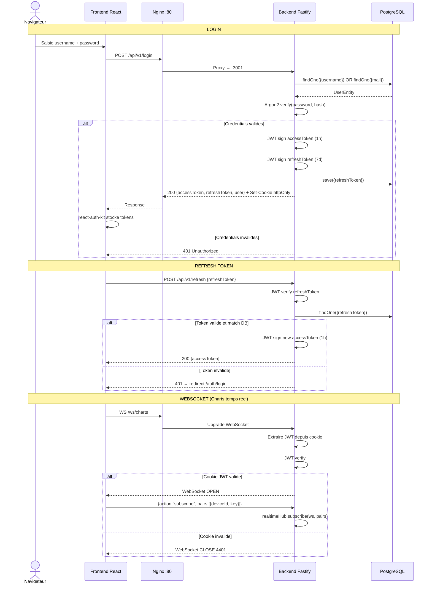

---

## 12. Diagramme de dépendances des services backend

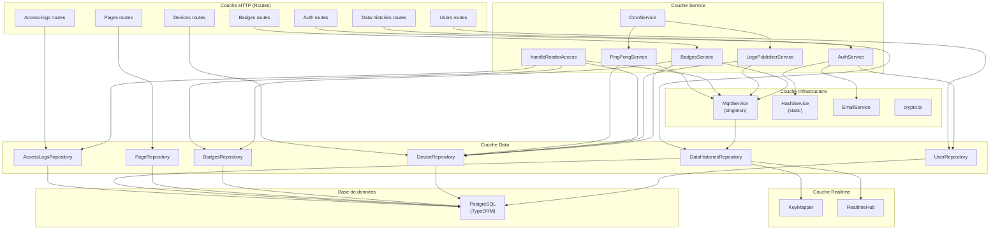

### 12.1 Observations sur les couches

Le backend utilise implicitement une **architecture en 4 couches** :

| Couche | Rôle | Fichiers |
|---|---|---|
| **HTTP** | Routes Fastify, validation Zod, sérialisation | `*.route.ts` |
| **Service** | Logique métier, orchestration | `*.service.ts`, `handleReaderAccess.ts` |
| **Infrastructure** | Services techniques transverses | `mqtt.service.ts`, `hash.service.ts`, `email.service.ts` |
| **Data** | Accès base de données | `*.repository.ts` |
| **Realtime** | Transformation de données et diffusion WS | `key-mapper.ts`, `realtime-hub.ts` |

Toutefois, cette séparation n'est **pas strictement appliquée** : certaines routes accèdent directement aux repositories sans passer par un service, et le `MqttService` instancie directement un `DataHistoriesRepository` dans son handler de message.

---

## 13. Inventaire des dépendances externes

### 13.1 Backend — dépendances de production (33)

| Catégorie | Package | Version |
|---|---|---|
| **Framework** | `fastify` | ^5.2.1 |
| | `fastify-plugin` | ^5.0.1 |
| | `fastify-type-provider-zod` | ^4.0.2 |
| **Auth** | `@fastify/auth` | ^5.0.2 |
| | `@fastify/jwt` | ^9.0.3 |
| | `@fastify/passport` | ^3.0.2 |
| | `@fastify/cookie` | ^11.0.2 |
| | `argon2` | ^0.43.0 |
| | `jsonwebtoken` | ^9.0.2 |
| **DB/ORM** | `typeorm` | ^0.3.20 |
| | `pg` | ^8.13.1 |
| | `@fastify/postgres` | ^6.0.2 |
| | `reflect-metadata` | ^0.2.2 |
| | `@prisma/client` | ^6.3.1 |
| **Communication** | `mqtt` | ^5.10.3 |
| | `@fastify/websocket` | ^11.2.0 |
| | `modbus-serial` | 8.0.20-no-serial-port |
| | `nodemailer` | ^7.0.3 |
| | `mailgen` | ^2.0.29 |
| **Sécurité** | `@fastify/cors` | ^10.0.2 |
| | `@fastify/helmet` | ^13.0.1 |
| **Utilitaires** | `zod` | ^3.24.4 |
| | `dotenv` | ^16.4.7 |
| | `pino` | ^9.6.0 |
| | `pino-pretty` | ^13.0.0 |
| | `uuid` | ^11.1.0 |
| | `date-fns` | ^4.1.0 |
| | `async-mutex` | ^0.5.0 |
| | `cron-schedule` | ^5.0.4 |
| | `true-myth` | ^9.0.1 |
| **Factory/Seed** | `@jorgebodega/typeorm-factory` | ^2.1.0 |
| | `@jorgebodega/typeorm-seeding` | ^7.1.0 |
| | `@faker-js/faker` | ^9.4.0 |

### 13.2 Frontend — dépendances de production (26)

| Catégorie | Package | Version |
|---|---|---|
| **Framework** | `react` | ^19.0.0 |
| | `react-dom` | ^19.0.0 |
| **Routing** | `@tanstack/react-router` | ^1.105.0 |
| **CSS** | `@tailwindcss/vite` | ^4.0.9 |
| **UI** | `@mui/material` | ^6.4.3 |
| | `@mui/icons-material` | ^6.4.7 |
| | `@mui/x-data-grid` | ^7.26.0 |
| | `@material-ui/core` | ^4.12.4 |
| | `@emotion/react` | ^11.14.0 |
| | `@emotion/styled` | ^11.14.0 |
| | `@toolpad/core` | ^0.12.0 |
| **Charts** | `vega` | ^6.1.2 |
| | `vega-lite` | ^6.2.0 |
| | `react-vega` | ^7.7.1 |
| | `@material-vega/core` | ^0.1.0 |
| | `@material-vega/material-ui` | ^0.2.1 |
| **DnD** | `@dnd-kit/core` | ^6.3.1 |
| | `@dnd-kit/sortable` | ^10.0.0 |
| | `@dnd-kit/utilities` | ^3.2.2 |
| **Auth** | `react-auth-kit` | ^3.1.3 |
| **i18n** | `i18next` | ^24.2.2 |
| | `react-i18next` | ^15.4.0 |
| **WebSocket** | `react-use-websocket` | ^4.13.0 |
| **Utilitaires** | `zod` | ^3.24.2 |
| | `dot-prop` | ^9.0.0 |
| | `react-helmet-async` | ^2.0.5 |

### 13.3 Dépendances notables à surveiller

| Package | Observation |
|---|---|
| `@prisma/client` ^6.3.1 | Installé mais **non utilisé** dans le code — seul TypeORM est actif |
| `@material-ui/core` ^4.12.4 | MUI v4 **obsolète** — coexiste avec MUI v6 (`@mui/material`) |
| `modbus-serial` 8.0.20-no-serial-port | Version patchée sans port série — installée mais aucune utilisation trouvée dans le code |
| `@jorgebodega/typeorm-factory` + `@faker-js/faker` | En `dependencies` (prod) au lieu de `devDependencies` |
| `@fastify/postgres` ^6.0.2 | Plugin PostgreSQL natif installé en parallèle de TypeORM — double ORM potentiel |

---

## 14. Constats sur l'architecture

| # | Constat | Sévérité | Impact |
|---|---|---|---|
| C01 | **Architecture feature-based cohérente** entre backend et frontend — même découpage par domaine métier | ✅ Positif | Facilite la navigation et la maintenance |
| C02 | **Séparation des couches incomplète** — certaines routes accèdent directement aux repositories sans service intermédiaire (ex: `getAllUsers.route.ts` → `UserRepository`) | 3/5 | Logique métier dispersée, testabilité réduite |
| C03 | **Double ORM installé** — `@prisma/client` (non utilisé) coexiste avec TypeORM | 2/5 | Confusion, dépendance inutile à maintenir |
| C04 | **Double MUI installé** — `@material-ui/core` v4 et `@mui/material` v6 en parallèle | 3/5 | Bundle size inutilement alourdi, API inconsistantes |
| C05 | **`modbus-serial` installé mais non utilisé** — aucun import trouvé dans le code | 2/5 | Dépendance orpheline |
| C06 | **Dépendances de test en production** — `@faker-js/faker`, `@jorgebodega/typeorm-factory`, `@jorgebodega/typeorm-seeding` sont dans `dependencies` au lieu de `devDependencies` | 3/5 | Image Docker plus lourde, risque en production |
| C07 | **Serveur unique** — broker MQTT, registre Docker, DB, backend, frontend sur la même machine `192.168.3.100` | 3/5 | SPOF (Single Point of Failure) |
| C08 | **Relations DB non contraintes** — la plupart des relations (pages↔cards, badges↔users) sont logiques sans FK TypeORM | 3/5 | Intégrité référentielle non garantie |
| C09 | **`synchronize: true` en production** — auto-synchronisation du schéma DB activée (data-source.ts) | 4/5 | Risque de perte de données en production |
| C10 | **Pas de validation de rôles sur les routes** — les routes protégées vérifient l'authentification JWT mais pas les rôles (admin/employee/security) | 4/5 | Tout utilisateur authentifié a accès à toutes les routes |
| C11 | **Route `/dashboard/lightings`** stub — page référencée dans le routeur mais sans contenu implémenté | 1/5 | Fonctionnalité incomplète |
| C12 | **PWA configurée** avec service worker et precaching — bonne pratique pour une app dashboard IoT locale | ✅ Positif | Utilisable hors-ligne |
| C13 | **Pas de rate limiting** sur les routes d'authentification (login, forgot-password) | 3/5 | Vulnérable au brute-force |
| C14 | **Config proxy Vite pointe vers la prod** — `vite.config.ts` frontend proxy vers `192.168.3.100:3000` (IP prod) au lieu de localhost | 2/5 | Développement couplé à l'infra de production |

---

## 15. Synthèse

### 15.1 Score d'architecture

| Critère | Score | Commentaire |
|---|---|---|
| Organisation du code | 4/5 | Feature-based cohérent, nommage clair, structure prévisible |
| Séparation des responsabilités | 3/5 | Couches identifiables mais pas toujours respectées |
| Modèle de données | 3/5 | 7 entités bien définies mais relations faiblement contraintes |
| Sécurité | 2/5 | JWT + Argon2 présents mais pas de RBAC, TLS partiel, pas de rate-limiting |
| Scalabilité | 2/5 | Serveur unique, pas de message queue, CRON en-process |
| Maintenabilité | 3/5 | Monorepo pnpm, TypeScript strict, mais double ORM et dépendances orphelines |
| Observabilité | 2/5 | Pino logger mais pas de métriques, pas de health checks MQTT |
| **Score global** | **2.7/5** | Architecture fonctionnelle et bien structurée pour un projet IoT local, mais avec des lacunes de sécurité et d'infrastructure à combler pour la production |

### 15.2 Résumé quantitatif

| Métrique | Valeur |
|---|---|
| Diagrammes produits | 11 (architecture, ER, séquence, dépendances, flux) |
| Entités base de données | 7 |
| Endpoints API REST | 17 + 1 WebSocket |
| Routes frontend | 14 |
| Services backend | 9 (auth, badge, logo-publisher, cron, mqtt, hash, email, reader-access, ping-pong) |
| Dépendances backend (prod) | 33 |
| Dépendances frontend (prod) | 26 |
| Constats architecturaux | 14 (2 positifs, 12 à améliorer) |
