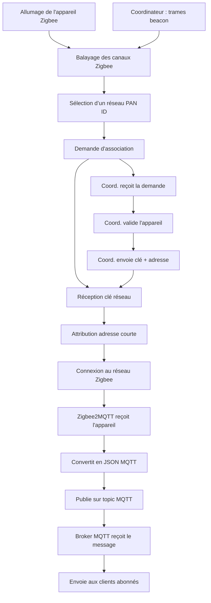

# Documentation : Intégration d'un système IoT Zigbee local via MQTT

## 1. Introduction

Ce document décrit le fonctionnement complet d'un système IoT en Zigbee, avec une intégration locale basée sur MQTT. L'ensemble de l'architecture repose sur une passerelle Zigbee2MQTT, un backend en Node.js, un frontend React et une base de données PostgreSQL.

## 2. Fonctionnement d'un réseau Zigbee

### 2.1 Rôles des composants Zigbee

- **Coordinateur Zigbee (ZC)** : Crée et gère le réseau Zigbee
    
- **Routeur Zigbee (ZR)** : Prolonge le réseau et relaye les messages
    
- **Dispositif terminal (ZED)** : Capteur/actionneur qui communique via ZR ou ZC
    

### 2.2 Appairage d'un périphérique Zigbee

1. Détection du réseau Zigbee par trames beacon
    
2. Requête d'association avec PAN ID
    
3. Attribution d'adresse courte (16 bits)
    
4. Distribution de la clé de réseau Zigbee (Network Key)
    
5. Authentification et inclusion dans le réseau
    

### 2.3 Isolation entre réseaux Zigbee

- PAN ID et Extended PAN ID
    
- Clés de chiffrement uniques (128 bits)
    
- Canaux radio distincts
    

## 3. Intégration Zigbee2MQTT + MQTT

### 3.1 Rôle de Zigbee2MQTT

- Se connecte à un dongle USB Zigbee
    
- Traduit trames Zigbee → JSON MQTT et inversement
    
- Publie et s'abonne à des topics MQTT précis
    

### 3.2 Conventions des topics MQTT

|Action|Topic|Direction|Exemple|
|---|---|---|---|
|Rapport d'état|`zigbee2mqtt/<device>`|Z2M → Broker|`zigbee2mqtt/salon_lampe`|
|Commande|`zigbee2mqtt/<device>/set`|Broker → Z2M|`{"state": "ON"}`|
|Requête de lecture (si supporté)|`zigbee2mqtt/<device>/get`|Broker → Z2M|`{"state": ""}`|
|Événement système|`zigbee2mqtt/bridge/event`|Z2M → Broker|`{"type": "device_joined"}`|

### 3.3 Exemple de payload MQTT complet

```json
{
  "temperature": 22.1,
  "humidity": 45.3,
  "battery": 95,
  "device": {
    "friendly_name": "salon_lampe",
    "ieeeAddr": "0x00158d0001234567",
    "manufacturer": "JETSTRÖM",
    "model": "Plafonnier",
    "type": "EndDevice"
  },
  "meta": {
    "lastSeen": 1717576578912
  }
}
```

### 3.4 Schéma BPMN – Réseau Zigbee intégré à MQTT



## 4. Backend Node.js (MQTT + API)

### 4.1 Fonctionnalités principales

- Connexion au broker MQTT
    
- Publication de commandes d'appairage
    
- Écoute des événements sur `bridge/event`
    
- Gestion des renommages et stockages en BDD (PostgreSQL)
    

### 4.2 Exemple d'appairage en Node.js (mqtt.js)

```ts
mqttClient.publish('zigbee2mqtt/bridge/request/permit_join', JSON.stringify({ value: true }))
```

### 4.3 Exemple de détection d'appareil

```ts
mqttClient.on('message', (topic, message) => {
  if (topic === 'zigbee2mqtt/bridge/event') {
    const payload = JSON.parse(message.toString());
    if (payload.type === 'device_joined') {
      console.log('Nouveau device:', payload.data.friendly_name);
    }
  }
});
```

## 5. Frontend React

### 5.1 Scénario typique

- Bouton « Détecter des appareils »
    
- Requête REST `POST /zigbee/pair`
    
- Affichage en temps réel des appareils détectés via WebSocket ou polling
    

## 6. BPMN : Appairage d’un appareil Zigbee

```mermaid
graph TD
    A[Frontend : clique sur "Détecter"] --> B[Backend : POST /zigbee/pair]
    B --> C[Backend publie permit_join]
    C --> D[Zigbee2MQTT ouvre le réseau]
    D --> E[Appareil rejoint le réseau]
    E --> F[Zigbee2MQTT publie device_joined]
    F --> G[Backend enregistre ou affiche l’appareil]
```

## 7. User Stories (mode Agile, en français)

### US001 - En tant qu'utilisateur

**Je veux** détecter les appareils Zigbee autour de moi  
**Afin de** pouvoir les appairer au système domotique  
**Critères d’acceptation** :

- Le bouton « Détecter » envoie une commande permit_join
    
- Les appareils nouvellement rejoints apparaissent dans la liste
    

### US002 - En tant que développeur

**Je veux** recevoir les événements de Zigbee2MQTT en temps réel  
**Afin de** gérer dynamiquement les appairages dans le backend  
**Critères d’acceptation** :

- Le backend est abonné au topic `zigbee2mqtt/bridge/event`
    
- Tous les events `device_joined` et `device_interview` sont traités
    

### US003 - En tant qu'utilisateur

**Je veux** renommer les appareils une fois détectés  
**Afin de** mieux les identifier  
**Critères d’acceptation** :

- Un champ de texte permet d’attribuer un `friendly_name`
    
- Le nom est envoyé via `bridge/request/device/rename`
    

### US004 - En tant qu'utilisateur

**Je veux** interagir avec un appareil Zigbee affiché dans l'interface  
**Afin de** contrôler un dispositif comme une électrovanne connectée  
**Critères d’acceptation** :

- Une carte ou interface affiche l'état actuel de l'électrovanne (ON/OFF)
    
- Un bouton permet d'envoyer une commande ON/OFF via MQTT (`/set`)
    
- L'état se met à jour dynamiquement à la réception du message MQTT
    

## 8. Annexes et références

### Liens utiles (du débutant à l’avancé)

- Zigbee2MQTT : [https://www.zigbee2mqtt.io](https://www.zigbee2mqtt.io)
    
- Documentation officielle MQTT : [https://mqtt.org/documentation](https://mqtt.org/documentation)
    
- Introduction au Zigbee : [https://fr.digi.com/solutions/by-technology/zigbee-wireless-standard](https://fr.digi.com/solutions/by-technology/zigbee-wireless-standard)
    
- Fundamentals of Zigbee (Silicon Labs) : [https://www.silabs.com/documents/public/user-guides/ug103-02-fundamentals-zigbee.pdf](https://www.silabs.com/documents/public/user-guides/ug103-02-fundamentals-zigbee.pdf)
    
- Debug MQTT avec Mosquitto : [https://mosquitto.org/man/mosquitto_sub-1.html](https://mosquitto.org/man/mosquitto_sub-1.html)
    

---

Ce document peut être complété par des schémas UML ou un modèle de données PostgreSQL si besoin.


| Couche OSI             | Zigbee Device (ZED)              | Passerelle Zigbee2MQTT       | MQTT Broker        |
|------------------------|----------------------------------|-------------------------------|---------------------|
| Application            | ZCL capteur                      | Zigbee2MQTT App               | MQTT Serveur        |
| Présentation           | —                                | —                             | —                   |
| Session                | Zigbee session logique (APS)     | MQTT CONNECT/DISCONNECT       | MQTT sessions       |
| Transport              | Zigbee APS                       | TCP/IP                        | TCP/IP              |
| Réseau                 | Zigbee NWK                       | —                             | —                   |
| Liaison de données     | MAC IEEE 802.15.4                | —                             | —                   |
| Physique               | PHY 2.4 GHz                      | 2.4 GHz radio (récepteur)     | —                   |

