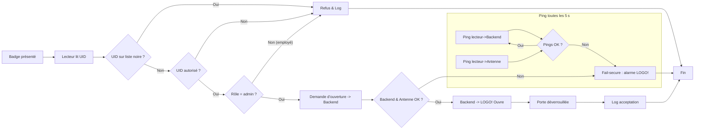

# Contrôle d’accès – Spécification fonctionnelle

## 1. Contexte

Une petite entreprise dispose d’une salle serveur protégée par une porte contrôlée. Le présent document décrit les exigences fonctionnelles pour le système de contrôle d’accès basé sur des cartes MIFARE Classic 1 K, un lecteur NFC ESP32, un backend Raspberry Pi et un automate Siemens LOGO!.

## 2. Rôles et droits

|Rôle|Accès à la salle serveur|Responsabilités principales|
|---|---|---|
|Administrateur système|✅|• Crée, active, met en liste noire et supprime les cartes ;• Supervise les journaux ;• Définit les certificats TLS.|
|Administrateur réseau|✅|• Entretien de l’infrastructure IT ;• Reçoit les alertes de panne du lecteur ou de l’antenne.|
|Employé|❌|• Utilise sa carte pour les locaux communs (hors périmètre ici).|
|Carte « lambda » (badge inconnu)|❌|• Système doit refuser et tracer chaque tentative.|
|Personne malveillante|❌|• Toute tentative de forçage ou présentation de badge falsifié doit déclencher le mode fail‑secure et une alerte.|

## 3. Matériel

- **Badges** : MIFARE Classic 1 K (Crypto‑1 propriétaire).
- **Lecteur** : ESP32 + module NFC V3.
- **Backend** : Raspberry Pi (Linux).
- **Actionneur** : Siemens LOGO! pilotant la gâche électrique.
    
## 4. Fonctionnement détaillé

1. **Création de cartes** : par l’administrateur système. Les cartes sont valides à vie sauf :
    - **Liste noire** : carte perdue ou interdite ⇒ refus immédiat.
        
2. **Lecture d’un badge**
    - Carte en liste noire → refus, log.
    - Carte employé → refus, log.
    - Carte administrateur réseau / administrateur système → backend ordonne l’ouverture, log.
        
3. **Supervision (toutes les 5 s)**
    - Le lecteur ping le backend **et** son antenne.
    - Si l’un des ping échoue : activation du mode _fail‑secure_, alarme LOGO!, porte verrouillée, ouverture possible uniquement par clé physique + code local LOGO!.
        
4. **Journalisation**
    - Horodatage NTP (Network Time Protocol), stockage local dans **PostgreSQL**, durée de conservation à définir (ex. 12 mois).
        
5. **Notifications**
    - Alertes “porte bloquée” émises par le LOGO!.
    - Autres alertes (perte de ping, carte inactive) envoyées par le backend (mail, webhook, à préciser).
        

## 5. Exigences et clarifications

- **Tolérance aux pannes** : pas d’UPS ; porte verrouillée par défaut ; clé mécanique disponible (procédure d’urgence à écrire).
- **Durcissement réseau** : chiffrement TLS et authentification mutuelle ; gestion des certificats à planifier.
- **Maintenance** : firmware OTA et sauvegardes hors périmètre pour le MVP mais à intégrer plus tard.
    

## 6. BPMN (Mermaid)

## 7. User Stories

| Rôle / Acteur              | User Story                                                                                                                                                                                                                                                                                                                                                                                            |
| -------------------------- | ----------------------------------------------------------------------------------------------------------------------------------------------------------------------------------------------------------------------------------------------------------------------------------------------------------------------------------------------------------------------------------------------------- |
| **Administrateur système** | 1. *En tant qu’administrateur système, je veux créer, activer, mettre en liste noire ou supprimer des cartes, afin de gérer les accès.*2. *En tant qu’administrateur système, je veux recevoir une notification quand une carte n’a pas été utilisée depuis 3 mois, afin d’investiguer.*3. _En tant qu’administrateur système, je veux consulter les journaux locaux, afin d’assurer la traçabilité._ |
| **Administrateur réseau**  | 1. *En tant qu’administrateur réseau, je veux que ma carte ouvre la salle serveur, afin de réaliser la maintenance IT.*2. _En tant qu’administrateur réseau, je veux être averti si le lecteur ou l’antenne devient indisponible, afin d’intervenir rapidement._                                                                                                                                      |
| **Employé**                | _En tant qu’employé, je veux que ma carte soit refusée à la salle serveur mais enregistrée, afin de respecter la politique de sécurité._                                                                                                                                                                                                                                                              |
| **Carte “lambda”**         | _En tant que porteur d’un badge non enregistré, je veux que ma tentative soit refusée et tracée, afin que le système reste sécurisé._                                                                                                                                                                                                                                                                 |
| **Personne malveillante**  | _En tant qu’attaquant, lorsque j’essaie de forcer l’ouverture ou de présenter un badge falsifié, le système doit rester verrouillé, déclencher une alarme et journaliser l’incident, afin de décourager toute intrusion._                                                                                                                                                                             |

## 8. Prochaines étapes

1. Fixer la durée de conservation des journaux (ex. 12 mois) et choisir le format (PostGresql).
2. Définir les canaux et destinataires des notifications (e‑mail, webhook, SMS…).
3. Rédiger la procédure d’accès d’urgence et répertorier les détenteurs de la clé physique.
4. Planifier la gestion et le renouvellement des certificats TLS.
5. Préparer le volet maintenance (mise à jour OTA, sauvegardes) pour une future version.