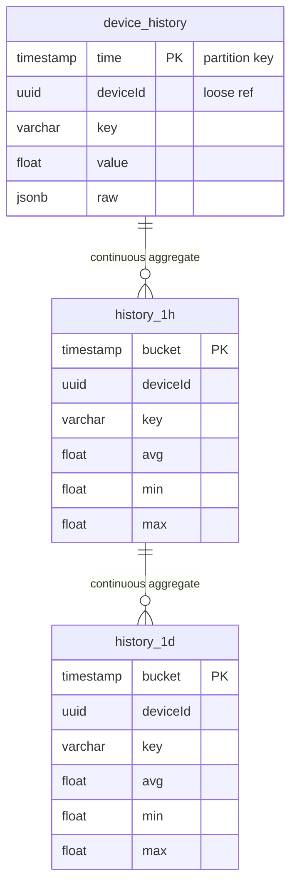

# Analyse & Décisions Architecture DB — simpl1Control Phase 2

Date : 21 mars 2026

---

## Contexte projet

Système domotique déployable pour utilisateurs non-techniques. 3 facettes :
- Gestion énergie (électricité) et calorifique (chauffage) via automate Siemens LOGO en MQTT
- Devices MQTT custom et existants (capteurs humidité, lumière, etc.)
- Protocoles Zigbee via Zigbee2MQTT

Le module badge/accès physique (MIFARE NFC) est un nice-to-have existant.

---

## User Stories — Interface utilisateur

### Profils & Interface
- En tant qu'utilisateur, je veux pouvoir enregistrer des profils d'interface afin d'avoir mes interfaces selon mes appareils distincts (GSM, PC, tablette)
- En tant qu'utilisateur, je veux pouvoir choisir le modèle d'interface afin qu'elle soit adaptée à mon appareil

### Pages & Tuiles
- En tant qu'utilisateur, je veux pouvoir créer des pages afin d'y trier mes tuiles
- En tant qu'utilisateur, je veux pouvoir créer des tuiles basées sur un device afin de grouper selon mes utilisations
- En tant qu'utilisateur, je veux pouvoir créer une tuile basée sur une consommation afin de voir les real-time charts basés sur celle-ci
- En tant qu'utilisateur, je veux pouvoir modifier des tuiles
- En tant qu'utilisateur, je veux pouvoir déplacer mes tuiles sur une autre page afin de grouper autrement
- En tant qu'utilisateur, je veux pouvoir dupliquer une tuile sur une autre page
- En tant qu'utilisateur, je veux pouvoir cliquer sur une tuile afin de voir les paramètres du device facilement

---

## Architecture générale — 3 services distincts

```
MQTT Broker (Mosquitto)
    │
    ├──► Backend API principale    → PostgreSQL       (config, état, users)
    ├──► Zigbee2MQTT (service)     → devices.yaml     (géré en interne, sync via MQTT)
    └──► Siemens LOGO              → via MQTT
              │
              └──► [bus MQTT interne : s1c/internal/history/]
                        │
                        └──► API Historisation → TimescaleDB
```

### Topics MQTT — convention
- `s1c/zigbee2mqtt/...`    → Zigbee2MQTT (existant)
- `s1c/devices/...`        → devices custom MQTT (existant)
- `s1c/internal/history/`  → bus interne backend → historisation (nouveau)

### Communication inter-services
- **MQTT uniquement** — pas de HTTP inter-services, pas de RabbitMQ
- Le backend principal publie sur `s1c/internal/history/` après chaque message device
- Le service historisation s'y abonne indépendamment
- Mosquitto gère sans problème le volume IoT attendu — pas de risque de surcharge

### Infrastructure monorepo
```
packages/
├── backend/     API principale — PostgreSQL
├── telemetry/   API historisation — TimescaleDB (Fastify v5 + TypeORM, allégé — pas d'auth/users/devices)
└── frontend/    UI
```
Même dépôt Git, Dockers distincts et indépendants.

---

## Principes DB retenus

- **Contraintes FK uniquement si flux applicatif** — pas pour les flux métier
  - Flux métier (badges ↔ users, access_logs) : intégrité gérée applicativement — les logs doivent survivre à la suppression d'un user, un badge physique existe indépendamment du système
  - Flux applicatif (profiles → pages → cards, device_states, zigbee_groups → zigbee_scenes) : FK appropriées
- `synchronize: false` partout — uniquement par migrations
- `jsonb` préféré à `json` — indexable avec GIN index, opérateurs natifs (`@>`, `?`, `->>`), mise à jour partielle

---

## Schéma DB Principal (PostgreSQL)

### Vue d'ensemble des relations

```
users
  └─FK─► profiles
              └─FK─► pages
                        └─FK─► cards
                                  └─loose─► devices | zigbee_groups | zigbee_scenes

devices
  ├─FK─► device_states
  └─FK─► zigbee_groups
               └─FK─► zigbee_scenes

badges      → loose userId
access_logs → loose userId, cardId
```

**FK strictes (flux applicatif) :**
- `profiles.userId → users.id`
- `pages.profileId → profiles.id`
- `cards.pageId → pages.id`
- `device_states.deviceId → devices.id`
- `zigbee_groups.deviceId → devices.id`
- `zigbee_scenes.groupId → zigbee_groups.id`

**Références loose (flux métier / tolérance à la suppression) :**
- `cards.targetId` — peut référencer un device/groupe/scène supprimé (affichage "introuvable" côté app)
- `badges.userId` — un badge physique existe indépendamment de l'user DB
- `access_logs.userId / cardId` — trace historique immuable

---

### Table `users` — inchangée

| Colonne | Type | Notes |
|---|---|---|
| `id` | uuid | PK |
| `createdAt` / `updatedAt` | timestamp | |
| `firstname`, `lastname`, `username` | varchar | |
| `password` | varchar | Hashé |
| `mail` | varchar | UNIQUE |
| `role` | enum | `admin` \| `employee` \| `security` |
| `refreshToken`, `resetToken` | varchar | Nullable |
| `resetTokenExpiry` | timestamp | Nullable |
| `lastLoginAt` | timestamp | Nullable |

---

### Table `devices` — refonte complète

**Principe :** configuration pure, données stables, décisions humaines uniquement.

| Colonne | Type | Notes |
|---|---|---|
| `id` | uuid | PK |
| `createdAt` / `updatedAt` | timestamp | |
| `name` | varchar | Nom affiché |
| `friendlyName` | varchar | Segment du topic MQTT |
| `protocol` | enum | `mqtt` \| `zigbee` \| `zigbee_group` \| `logo` |
| `subscribe` | varchar | Topic écoute, nullable |
| `publish` | varchar | Topic commande, nullable |
| `roles` | enum[] | `admin` \| `employee` \| `security` |
| `isSecure` | boolean | `false`=port 1883 / `true`=port 8883 (TLS) |
| `adminStatus` | enum | `enabled` \| `disabled` \| `maintenance` — décision humaine |
| `description` | varchar | Nullable |
| `capabilities` | jsonb | Attributs + controls spécifiques au protocole |

**Colonnes supprimées de l'ancienne table :**
`deviceId` (varchar), `brand`, `model`, `seed`, `keyValues`, `isOnline`, `isActive`, `status`, `metadata`

#### `capabilities.controls` — format unifié tous protocoles

```json
{
  "controls": [
    { "key": "state",       "widget": "toggle",  "access": "rw", "onValue": "ON", "offValue": "OFF" },
    { "key": "brightness",  "widget": "slider",  "access": "rw", "min": 0, "max": 254, "unit": "%" },
    { "key": "temperature", "widget": "display", "access": "r",  "unit": "°C" },
    { "key": "system_mode", "widget": "select",  "access": "rw", "values": ["off","heat","auto"] },
    { "key": "power",       "widget": "chart",   "access": "r",  "unit": "W" },
    { "key": "unknown_x",   "widget": "raw",     "access": "rw" }
  ]
}
```

#### Widgets disponibles

| Widget | Usage | Access |
|---|---|---|
| `display` | Valeur lecture seule | r |
| `toggle` | On/off binaire | rw |
| `slider` | Valeur numérique avec min/max | rw |
| `select` | Liste de valeurs enum | rw |
| `thermostat` | Composite display + slider (température actuelle + consigne) | rw |
| `chart` | Real-time chart — ouvre modal full-screen au clic | r |
| `scene` | Bouton unique "Rappeler" | rw |
| `raw` | **Fallback universel** — cas inconnu ou non mappé, jamais bloquant | r/rw |

#### Origine des `controls` selon protocole

| Protocole | Origine |
|---|---|
| **Zigbee** | Auto-rempli depuis `exposes` Z2M à l'appairage (`access 1`=r, `access 7`=rw) |
| **Zigbee Group** | Intersection des controls des devices membres |
| **Custom MQTT** | Saisi manuellement par l'utilisateur à la création du device |
| **LOGO** | Saisi manuellement (blocs Q/I/M/V déclarés) |
| **Cas inconnu** | Widget `raw` automatiquement attribué |

#### Intégration Zigbee2MQTT

L'app ne touche jamais à `configuration.yaml` — tout passe par MQTT :
- `s1c/zigbee2mqtt/bridge/devices` — liste complète + `exposes` au démarrage → sync `devices` + auto-remplissage `capabilities.controls`
- `s1c/zigbee2mqtt/bridge/event` — appairages / suppressions
- `s1c/zigbee2mqtt/[ieee_address ou friendly_name]` — état temps réel reçu
- `s1c/zigbee2mqtt/[ieee_address ou friendly_name]/set` — commandes envoyées
- `s1c/zigbee2mqtt/bridge/request/[action]` → gestion bridge (rename, group, scene...)

**Note sur l'identifiant de topic :** Z2M utilise soit l'IEEE address soit le `friendly_name` selon la configuration. Le champ `friendlyName` sur `devices` stocke **l'identifiant exact utilisé dans le topic** (ex: `0x54ef441000e1f853` ou `thermostat_salon`). Les champs `subscribe` et `publish` sont construits à partir de cet identifiant.

#### Contrat de données MQTT — Zigbee

**Reçu** sur `s1c/zigbee2mqtt/0x54ef441000e1f853` (exemple switch Aqara) :
```json
{
  "action": "single_right",
  "battery": 100,
  "device_temperature": 25,
  "linkquality": 255,
  "power_outage_count": 26,
  "state": "OFF",
  "voltage": 3300
}
```

**Envoyé** sur `s1c/zigbee2mqtt/0x54ef441000e1f853/set` (exemple lampe) :
```json
{ "state": "ON" }
{ "state": "ON", "brightness": 180 }
{ "occupied_heating_setpoint": 21 }
{ "system_mode": "heat" }
```

**Ce que Z2M fournit dans `bridge/devices`** pour identifier le device :
```json
{
  "ieee_address": "0x54ef441000e1f853",
  "friendly_name": "0x54ef441000e1f853",
  "definition": {
    "model": "WXKG11LM",
    "vendor": "Aqara",
    "description": "Wireless mini switch",
    "exposes": [...]
  },
  "power_source": "Battery",
  "model_id": "lumi.sensor_switch.aq2"
}
```

**Règles de mapping `exposes` → `capabilities.controls` :**

| Type Z2M | Access | Widget déduit |
|---|---|---|
| `numeric` | 1 (r) | `display` |
| `numeric` | 7 (rw) | `slider` |
| `binary` | 7 (rw) | `toggle` |
| `enum` | 7 (rw) | `select` |
| `enum` / `text` | 1 (r) | `display` |
| type inconnu | any | `raw` |

**`capabilities` stocké après transformation** (exemple switch Aqara) :
```json
{
  "vendor": "Aqara",
  "model": "WXKG11LM",
  "description": "Wireless mini switch",
  "powerSource": "Battery",
  "ieeeAddress": "0x54ef441000e1f853",
  "networkAddress": 29159,
  "controls": [
    { "key": "action",             "widget": "display", "access": "r" },
    { "key": "state",              "widget": "toggle",  "access": "rw", "onValue": "ON", "offValue": "OFF" },
    { "key": "battery",            "widget": "display", "access": "r",  "unit": "%" },
    { "key": "voltage",            "widget": "display", "access": "r",  "unit": "mV" },
    { "key": "linkquality",        "widget": "display", "access": "r" },
    { "key": "device_temperature", "widget": "display", "access": "r",  "unit": "°C" },
    { "key": "power_outage_count", "widget": "display", "access": "r" }
  ]
}
```

#### Exemple `capabilities` Zigbee Group

```json
{
  "members": [
    { "deviceId": "uuid-ampoule-1", "endpoint": "1" },
    { "deviceId": "uuid-ampoule-2", "endpoint": "1" }
  ],
  "controls": [
    { "key": "state",      "widget": "toggle", "access": "rw", "onValue": "ON", "offValue": "OFF" },
    { "key": "brightness", "widget": "slider", "access": "rw", "min": 0, "max": 254, "unit": "%" }
  ]
}
```

#### Exemple `capabilities` Custom MQTT (Arduino)

```json
{
  "controls": [
    { "key": "temperature", "widget": "display", "access": "r", "unit": "°C" },
    { "key": "humidity",    "widget": "display", "access": "r", "unit": "%" }
  ]
}
```

#### Exemple `capabilities` Siemens LOGO

```json
{
  "plcAddress": "192.168.1.100",
  "rack": 0,
  "slot": 1,
  "blocks": { "Q1": "pompe_chauffage", "Q2": "vanne_zone1", "I1": "capteur_pression" },
  "controls": [
    { "key": "Q1", "widget": "toggle", "access": "rw", "label": "Pompe chauffage" },
    { "key": "I1", "widget": "display", "access": "r", "label": "Capteur pression" }
  ]
}
```

---

### Table `device_states` — observation runtime (nouvelle)

**Principe : 1 ligne par device, upsert à chaque message MQTT. Jamais plus d'une ligne par device.**

| Colonne | Type | Notes |
|---|---|---|
| `deviceId` | uuid | PK + FK → `devices.id` |
| `technicalStatus` | enum | `online` \| `offline` \| `unreachable` |
| `lastSeenAt` | timestamp | Dernier message reçu |
| `updatedAt` | timestamp | |
| `state` | jsonb | Dernier payload MQTT brut |

#### Sémantique `technicalStatus`
- `online` — messages reçus dans la fenêtre de temps attendue
- `offline` — plus de messages depuis X minutes (déduit par job périodique sur `lastSeenAt`)
- `unreachable` — confirmé explicitement par le broker ou Z2M (topic `availability`)

#### Flux de mise à jour à chaque message MQTT
```
Message MQTT reçu
    ├──► UPSERT device_states          (état courant — DB principale)
    ├──► PUBLISH s1c/internal/history  (bus MQTT interne → service historisation)
    └──► EMIT WebSocket                (frontend temps réel)
```
Les 3 opérations sont indépendantes et non bloquantes.

---

### Table `profiles` — profils d'interface (nouvelle)

**Principe :** 1 profil `isDefault` créé automatiquement à l'inscription (non supprimable — règle applicative). L'user crée ensuite autant de profils que souhaité.

| Colonne | Type | Notes |
|---|---|---|
| `id` | uuid | PK |
| `createdAt` / `updatedAt` | timestamp | |
| `userId` | uuid | FK → `users.id` |
| `name` | varchar | Ex : "Mon GSM", "Bureau" |
| `deviceType` | enum | `desktop` \| `tablet` \| `mobile` |
| `isDefault` | boolean | `true` = profil système non supprimable |

#### Détection automatique de profil
- User-Agent sniffing côté frontend → `deviceType` détecté
- L'API retourne le profil matching `userId + deviceType`
- 1 profil matching → chargement direct
- N profils matching → sélecteur présenté à l'utilisateur
- 0 profil matching → fallback sur `isDefault`

---

### Table `pages` — pages d'un profil (refonte)

| Colonne | Type | Notes |
|---|---|---|
| `id` | uuid | PK |
| `createdAt` / `updatedAt` | timestamp | |
| `profileId` | uuid | FK → `profiles.id` |
| `name` | varchar | |
| `position` | int | Ordre d'affichage dans le profil |

**Supprimée :** colonne `cardIds uuid[]` — remplacée par FK `cards.pageId`

---

### Table `cards` — tuiles (refonte complète)

**Principe de séparation des responsabilités :**
- **`cards`** → sélectionne les keys à exposer dans la tuile
- **`devices.capabilities.controls`** → source de vérité sur comment rendre chaque key (widget, access, options)
- **Frontend** → rend les widgets, gère l'affichage compact/modal, refresh chart

| Colonne | Type | Notes |
|---|---|---|
| `id` | uuid | PK |
| `createdAt` / `updatedAt` | timestamp | |
| `pageId` | uuid | FK → `pages.id` |
| `name` | varchar | |
| `isActive` | boolean | |
| `position` | int | Ordre drag & drop dans la page |
| `targetType` | enum | `device` \| `group` \| `scene` |
| `targetId` | uuid | Loose ref → `devices.id` \| `zigbee_groups.id` \| `zigbee_scenes.id` |
| `selectedKeys` | varchar[] | Keys choisies parmi `capabilities.controls` (vide = tout afficher) |

#### Comportement de rendu (Frontend uniquement — pas de DB)
- **Compact** (sur la page) : résumé, interactions simples (toggle), clic ouvre la modal
- **Modal** : toutes les `selectedKeys` + widgets interactifs complets (slider, thermostat, select...)
- **Modal chart** : full-screen, timerange selector, refresh configurable (1s / 5s / 30s / 1min / 15min / 1h...)

#### Règles métier
- **Déplacement** : UPDATE `pageId` + recalcul des `position`
- **Duplication** : INSERT simple avec nouveau `id` et nouveau `pageId` — entité indépendante, aucun lien parent-enfant

---

### Table `zigbee_groups` — groupes Zigbee (nouvelle)

**Cas d'usage :** lustre multi-ampoules, éclairage cage d'escalier — 1 commande broadcast radio vers N devices simultanément. Exposé par Z2M exactement comme un device ordinaire sur le bus MQTT.

| Colonne | Type | Notes |
|---|---|---|
| `id` | uuid | PK |
| `createdAt` / `updatedAt` | timestamp | |
| `deviceId` | uuid | FK → `devices.id` (protocol=`zigbee_group`) |
| `groupId` | int | ID numérique Zigbee géré par Z2M |
| `friendlyName` | varchar | Nom dans Z2M |

---

### Table `zigbee_scenes` — scènes Zigbee (nouvelle)

**Principe :** mémorise un état précis d'un groupe. Stocké dans la mémoire firmware des devices membres — Z2M et l'app ne stockent que les métadonnées.

| Colonne | Type | Notes |
|---|---|---|
| `id` | uuid | PK |
| `createdAt` / `updatedAt` | timestamp | |
| `groupId` | uuid | FK → `zigbee_groups.id` |
| `sceneId` | int | ID Zigbee (0-255), stocké dans le firmware |
| `name` | varchar | Ex : "Ambiance soirée", "Mode nuit" |

---

### Table `badges` — PK révisé

**Décision :** `cardId` bytea = PK simple. Le `id` UUID de BaseEntity est supprimé (redondant). L'UID MIFARE est gravé en usine, physiquement immuable → PK immuable correct. `badges` n'étend pas BaseEntity.

| Colonne | Type | Notes |
|---|---|---|
| `cardId` | bytea | **PK simple** — UID physique MIFARE (4 ou 7 bytes) |
| `createdAt` / `updatedAt` | timestamp | Gérés manuellement |
| `deniedAccessFlag` | boolean | Default `false` |
| `userId` | uuid | UNIQUE, loose ref (pas de FK) — flux métier |
| `keyA`, `keyB` | bytea | Clés secteur MIFARE |

---

### Table `access_logs` — inchangée

Trace historique immuable — pas de FK intentionnel.

| Colonne | Type | Notes |
|---|---|---|
| `id` | uuid | PK |
| `createdAt` / `updatedAt` | timestamp | |
| `cardId` | bytea | Nullable, loose ref |
| `userId` | uuid | Nullable, loose ref |
| `accessOutcome` | varchar | `'granted'` \| `'denied'` |
| `source` | varchar | Point d'entrée / lecteur |

---

### Table supprimée

`data_histories` → entièrement remplacée par hypertable TimescaleDB dans `packages/history`.

---

## Schéma DB Historisation — TimescaleDB (`packages/history`)

### Pourquoi TimescaleDB
- Extension PostgreSQL — même stack, même ORM, même outillage
- Hypertables avec partitionnement automatique par timestamp
- Continuous Aggregates (vues matérialisées auto-rafraîchies)
- Retention Policies automatiques par granularité
- Compatible Grafana si dashboards avancés nécessaires

### Table `device_history` — hypertable

```
device_history  ← hypertable (partition sur time)
├── time        timestamp   partition key
├── deviceId    uuid        loose ref → devices.id (backend principal)
├── key         varchar     "temperature" | "power" | "brightness" | ...
├── value       float       valeur numérique
└── raw         jsonb       payload brut complet (purge rapide — 7j)
```

### Stratégie de rétention progressive

| Granularité | Rétention | Type TimescaleDB |
|---|---|---|
| Brut (payload MQTT) | 7 jours | Hypertable |
| Agrégat 1 heure | 90 jours | Continuous Aggregate |
| Agrégat 1 jour | 2 ans | Continuous Aggregate |
| Agrégat 1 semaine | indéfinie | Continuous Aggregate |
| Agrégat 1 mois | indéfinie | Continuous Aggregate (bilan énergie) |

---

## Questions ouvertes restantes

1. **`selectedKeys` sur `cards`** — rester en `varchar[]` simple ou permettre des options par key (ex: `chartRefresh`, `defaultTimeWindow`) via `jsonb[]` pour les cas chart ?
2. **`widgetType` exhaustif** — affiner la liste selon les premiers devices réels rencontrés en intégration

---

## ER Diagram — Schéma DB Final

```mermaid
erDiagram

    users {
        uuid id PK
        timestamp createdAt
        timestamp updatedAt
        varchar firstname
        varchar lastname
        varchar username
        varchar password
        varchar mail "UNIQUE"
        varchar role "admin|employee|security"
        varchar refreshToken
        varchar resetToken
        timestamp resetTokenExpiry
        timestamp lastLoginAt
    }

    profiles {
        uuid id PK
        timestamp createdAt
        timestamp updatedAt
        uuid userId FK
        varchar name
        varchar deviceType "desktop|tablet|mobile"
        boolean isDefault
    }

    pages {
        uuid id PK
        timestamp createdAt
        timestamp updatedAt
        uuid profileId FK
        varchar name
        int position
    }

    cards {
        uuid id PK
        timestamp createdAt
        timestamp updatedAt
        uuid pageId FK
        varchar name
        boolean isActive
        int position
        varchar targetType "device|group|scene"
        uuid targetId "loose ref"
        varchar selectedKeys "varchar[]"
    }

    devices {
        uuid id PK
        timestamp createdAt
        timestamp updatedAt
        varchar name
        varchar friendlyName
        varchar protocol "mqtt|zigbee|zigbee_group|logo"
        varchar subscribe
        varchar publish
        varchar roles "enum[]"
        boolean isSecure
        varchar adminStatus "enabled|disabled|maintenance"
        varchar description
        jsonb capabilities
    }

    device_states {
        uuid deviceId PK "FK devices.id"
        varchar technicalStatus "online|offline|unreachable"
        timestamp lastSeenAt
        timestamp updatedAt
        jsonb state
    }

    zigbee_groups {
        uuid id PK
        timestamp createdAt
        timestamp updatedAt
        uuid deviceId FK
        int groupId
        varchar friendlyName
    }

    zigbee_scenes {
        uuid id PK
        timestamp createdAt
        timestamp updatedAt
        uuid groupId FK
        int sceneId
        varchar name
    }

    badges {
        bytea cardId PK "UID MIFARE"
        timestamp createdAt
        timestamp updatedAt
        boolean deniedAccessFlag
        uuid userId "UNIQUE loose ref"
        bytea keyA
        bytea keyB
    }

    access_logs {
        uuid id PK
        timestamp createdAt
        timestamp updatedAt
        bytea cardId "loose ref"
        uuid userId "loose ref"
        varchar accessOutcome
        varchar source
    }

    %% FK strictes - flux applicatif
    users ||--o{ profiles : "userId"
    profiles ||--o{ pages : "profileId"
    pages ||--o{ cards : "pageId"
    devices ||--|| device_states : "deviceId"
    devices ||--o{ zigbee_groups : "deviceId"
    zigbee_groups ||--o{ zigbee_scenes : "groupId"

    %% Références loose - flux métier (pas de FK)
    cards }o--o| devices : "targetId (loose)"
    cards }o--o| zigbee_groups : "targetId (loose)"
    cards }o--o| zigbee_scenes : "targetId (loose)"
    badges }o--o| users : "userId (loose)"
    access_logs }o--o| users : "userId (loose)"
```



### DB Historisation — TimescaleDB (`packages/history`)


